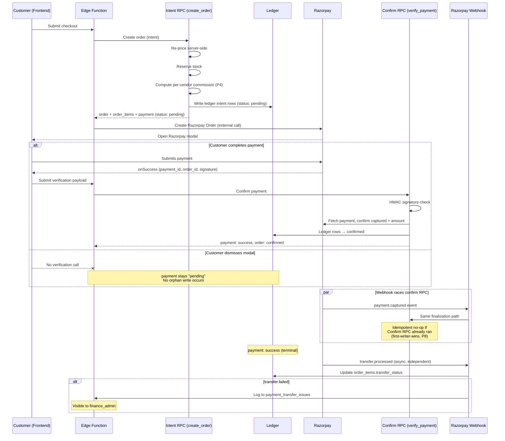
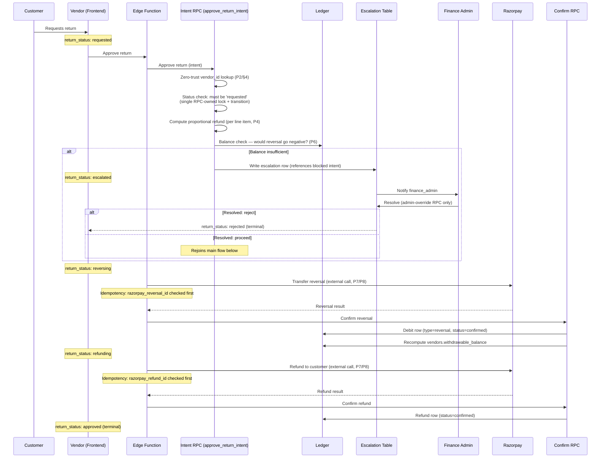
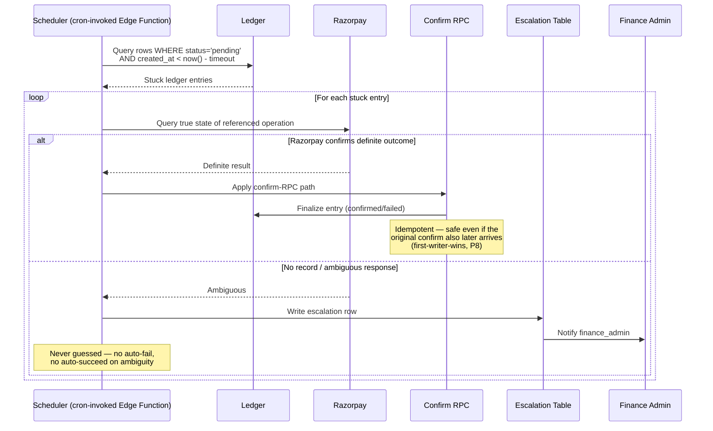
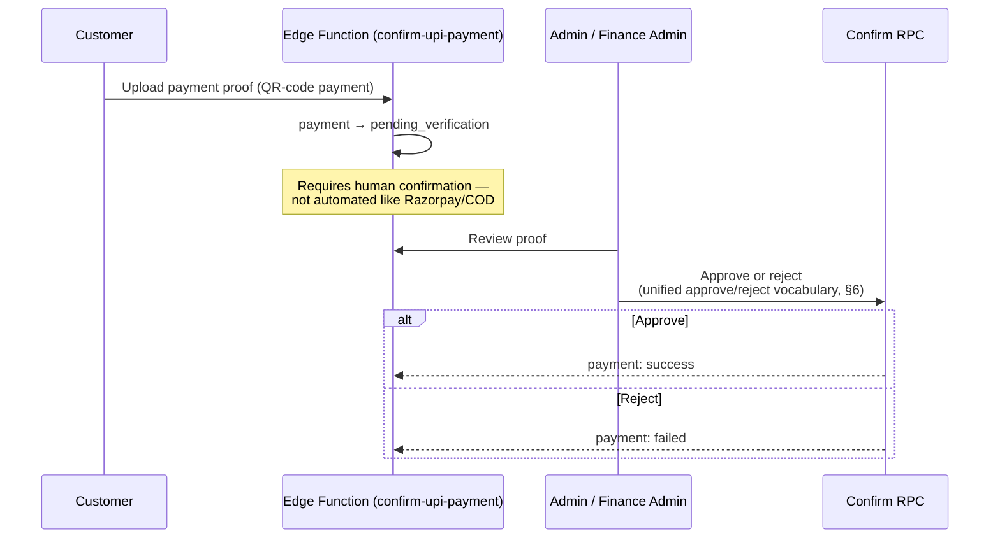

Status: Final
Version: 1.0
Owner: Fariha Asif (Product & Architecture)
Last Updated: 2026-07-19
Architecture Scope: Payment, Ledger, Payout, Return, and Reconciliation Subsystems

# KoshurKart Payment System — Sequence Diagrams

**Purpose:** Visual (Mermaid) representations of the workflows already defined in `02-state-machines.md`. These diagrams are a rendering aid for onboarding and review — they do not define new behavior. Where a diagram and `02-state-machines.md` ever appear to differ, the text in `02-state-machines.md` is authoritative and this document should be corrected to match it.

**Companion documents:** `01-core-architecture-specification.md` · `02-state-machines.md` (source of truth for all flows below) · `03-database-ledger-specification.md` · `04-operational-standards.md` · `05-architecture-decisions.md` · `06-glossary.md`

---

## 1. Customer Checkout (Razorpay Path)

Source: `02-state-machines.md` §1



**COD variant:** Same intent RPC path; no Razorpay Order step. Finalization triggered by `admin-verify-payment` on delivery confirmation, using the same Confirm RPC pattern shown above.

**Manual UPI variant:** See Diagram 5.

---

## 2. Vendor Payout

Source: `02-state-machines.md` §2

```mermaid
sequenceDiagram
    participant V as Vendor (Frontend)
    participant EF as Edge Function
    participant IR as Intent RPC (request_payout)
    participant L as Ledger
    participant FA as Finance Admin
    participant RP as Razorpay Route
    participant CR as Confirm RPC

    V->>EF: Request payout
    EF->>EF: Generate/lookup request-nonce (P9)
    EF->>IR: Request payout (intent)
    IR->>IR: Map nonce → operation key
    IR->>L: Balance check (ledger-derived, P5)
    alt Balance insufficient
        IR-->>EF: Blocked — no overdraft (P6)
        EF-->>V: Payout rejected
    else Balance sufficient
        IR->>L: Reserve amount (type=reservation, status=pending)
        IR->>IR: Method IDOR check (vendor_payment_setup)
        IR-->>EF: payout: pending (debited via reservation)
    end

    EF->>FA: Payout awaiting review
    FA->>EF: Approve or reject

    alt Rejected / cancelled / failed at review
        EF->>CR: Reverse reservation
        CR->>L: Credit row (type=adjustment)
        CR-->>EF: payout: terminal (rejected/cancelled/failed)
    else Approved (processing)
        EF->>RP: Initiate transfer (external call, P8)
        alt Transfer succeeds
            RP-->>EF: Success
            EF->>CR: Confirm success
            CR->>L: Reservation → confirmed
            CR-->>EF: payout: completed (terminal)
        else Transfer fails
            RP-->>EF: Failure
            EF->>CR: Confirm failure
            CR->>L: Reservation → failed; credit-back row (adjustment)
            CR-->>EF: payout: failed (terminal)
        end
    end
```

**Note:** The reservation created at intent time already reflects in the derived balance — there is no separate later "debit" step. Completion only confirms the existing reservation (see `02-state-machines.md` §2 note on the reservation model).

---

## 3. Return Approval

Source: `02-state-machines.md` §3



**Critical rule preserved:** the status pre-condition check, lock, and transition all happen inside the single Intent RPC — no separate optimistic-lock write occurs in the Edge Function (closes the original BLOCKER-1 defect shape; see `05-architecture-decisions.md` and `02-state-machines.md` §3).

---

## 4. Reconciliation Sweep

Source: `02-state-machines.md` §5



---

## 5. Manual UPI Verification

Source: `02-state-machines.md` §1 ("Direct/manual UPI variant")



**Naming convention note:** this flow uses the same `approve`/`reject` action vocabulary as every other admin decision point in the system (payouts, returns, escalations) — no separate `verify` action exists (`02-state-machines.md` §6).
